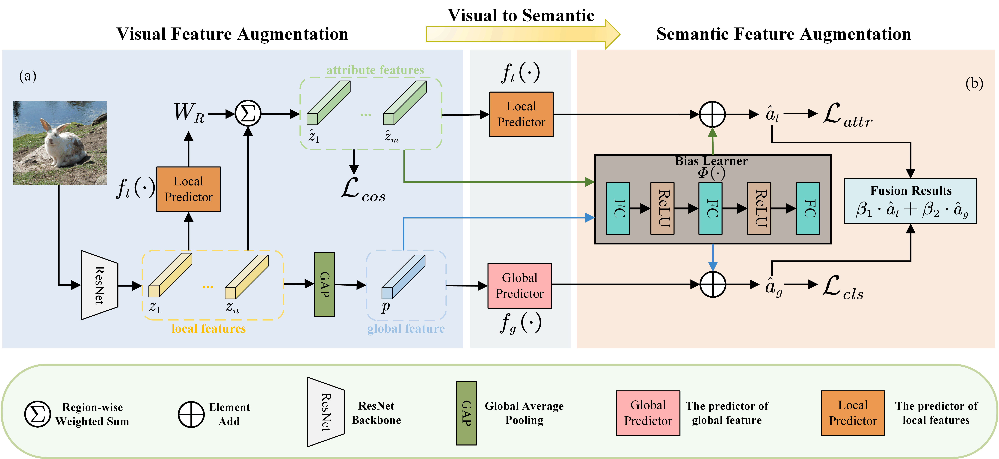

# DFAN


This repository contains the training and test code for the paper  "***Dual Feature Augmentation Network for
Generalized Zero-shot Learning***" accepted to BMVC 2023. 



## Running Environment
The implementation of **DFAN** is mainly based on Python 3.7.16 and [PyTorch](https://pytorch.org/) 1.12.1. To install all required dependencies:
```
$ pip install -r requirements.txt
```

### Training Script
```
$ python main.py --training --dataset DATA_SET --mat_path MAT_PATH
```


### Preparing Dataset and Model

We provide trained models ([Google Drive](https://drive.google.com/drive/folders/1PQkewCqlEl8FbgFOboB7WqmGgIvN95x9?usp=sharing)) on three different datasets: [CUB](http://www.vision.caltech.edu/visipedia/CUB-200-2011.html), [SUN](http://cs.brown.edu/~gmpatter/sunattributes.html), [AWA2](http://cvml.ist.ac.at/AwA2/) following the data split of [xlsa17](http://datasets.d2.mpi-inf.mpg.de/xian/xlsa17.zip) in the CZSL/GZSL setting. 

## Citation:
If you use DFAN in your research, please use the following BibTeX entry.
```
@article{xiang2023dual,
  title={Dual Feature Augmentation Network for Generalized Zero-shot Learning},
  author={Xiang, Lei and Zhou, Yuan and Duan, Haoran and Long, Yang},
  journal={arXiv preprint arXiv:2309.13833},
  year={2023}
}
```


## References
Parts of our codes based on:
* [FaisalAlamri0/ViT-ZSL](https://github.com/FaisalAlamri0/ViT-ZSL)

## Contact
If you have any questions about codes, please don't hesitate to contact us by xl294487391@gmail.com.
